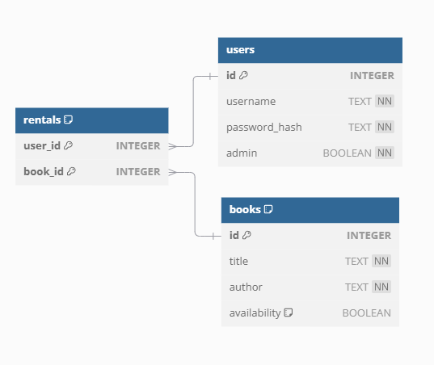

## LibraryManagementApp Overview

LibraryManagementApp is a REST API built with Java 17, Spring Boot and SQLite.

The application is divided into several directories, each responsible for a specific aspect of the system.

### Models
The models package contains the classes that represent the entities of the system, such as Books and Users.

### Database
The database package contains the classes that are responsible for interacting with the database, such as DatabaseInitializer and BookRepository.

A simple diagram of the database schema:

### API Endpoints
The api package contains the classes that are responsible for handling the API endpoints, such as BookAPI and UserAPI.

Book Endpoints

GET /api/books: Retrieve a list of all books
GET /api/books/{id}: Retrieve a book by ID
POST /api/books: Create a new book
PUT /api/books/{id}: Update a book by ID
DELETE /api/books/{id}: Delete a book by ID
User Endpoints

GET /api/users: Retrieve a list of all users
GET /api/users/{id}: Retrieve a user by ID
POST /api/users: Create a new user
PUT /api/users/{id}: Update a user by ID
DELETE /api/users/{id}: Delete a user by ID
Rental Endpoints

GET /api/rentals: Retrieve a list of all rentals
GET /api/rentals/{id}: Retrieve a rental by ID
POST /api/rentals: Create a new rental
PUT /api/rentals/{id}: Update a rental by ID
DELETE /api/rentals/{id}: Delete a rental by ID